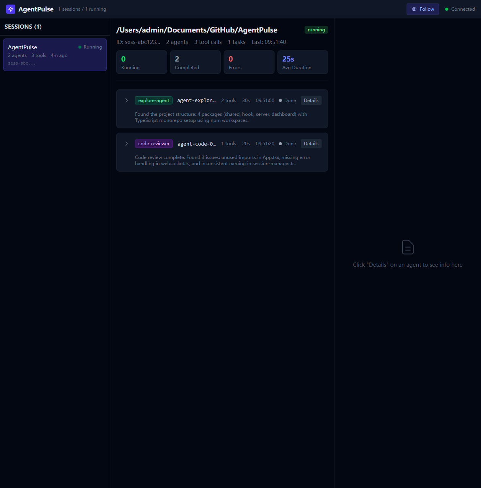
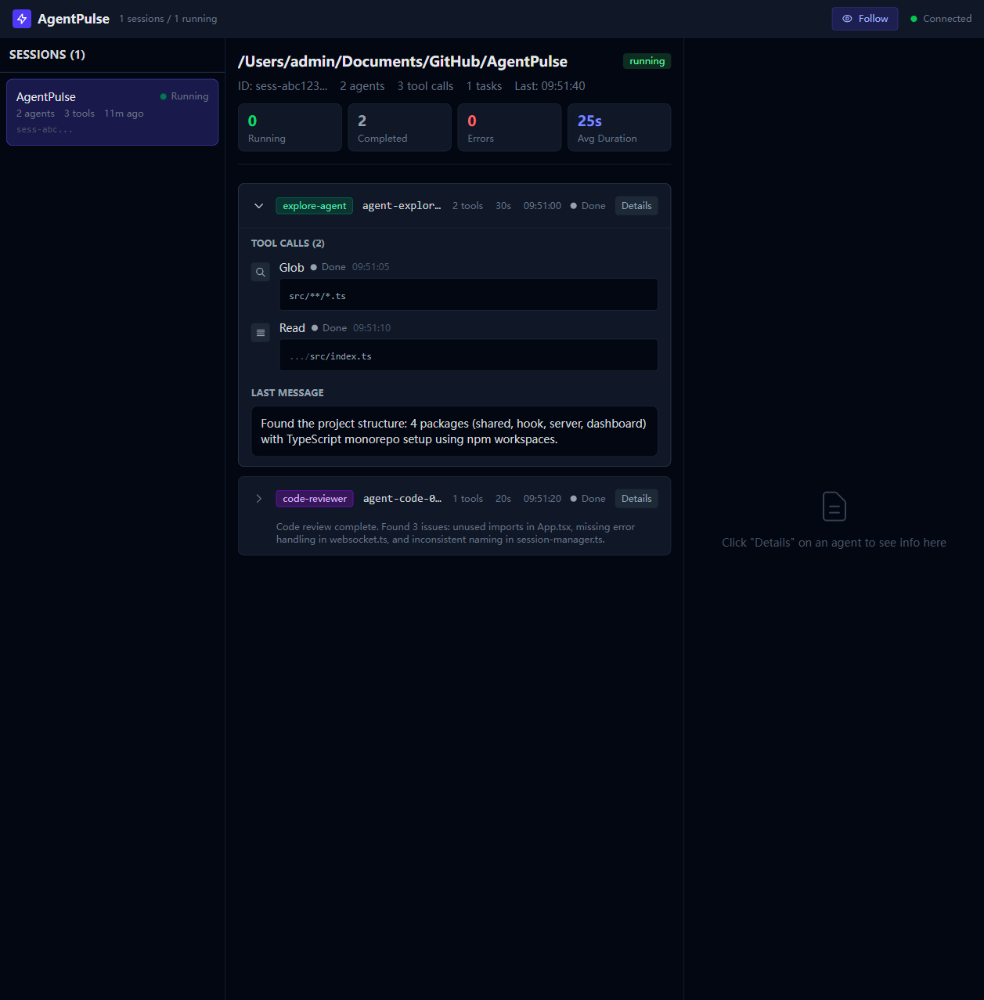
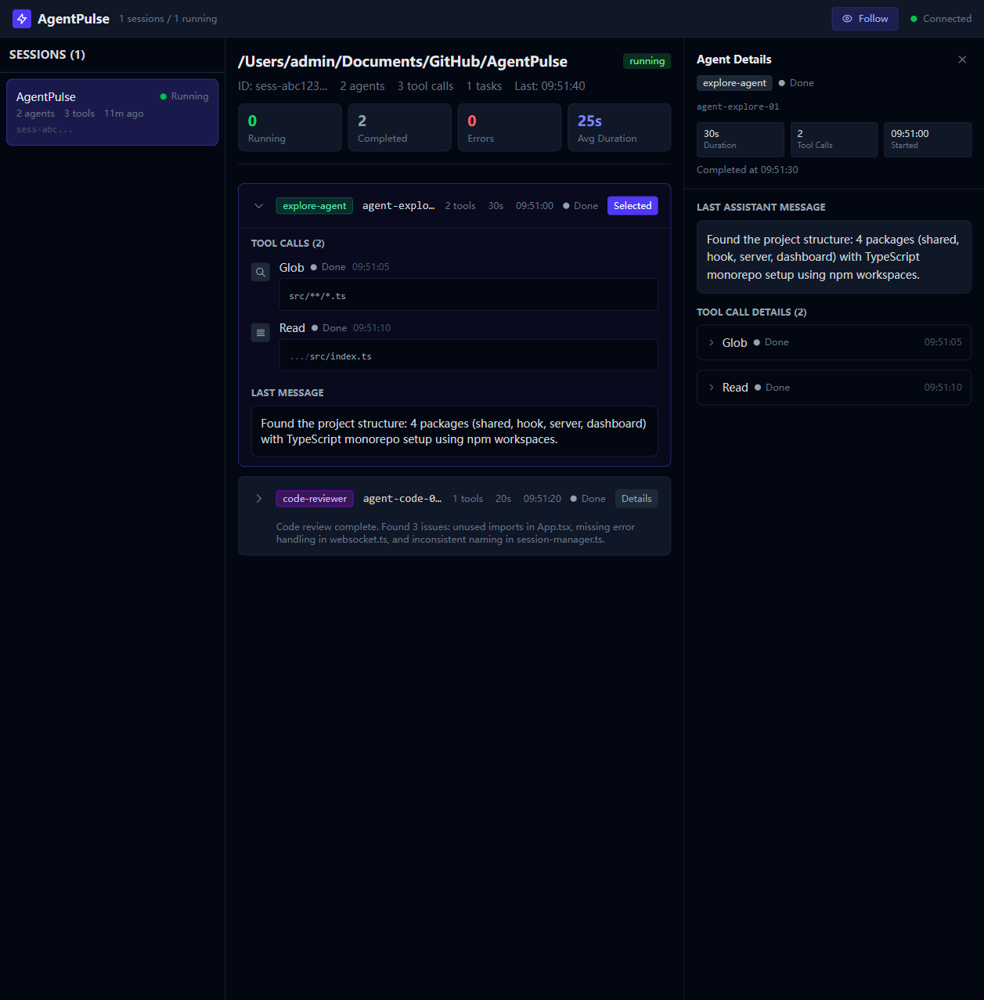

# AgentPulse

Real-time Web Dashboard for monitoring Claude Code sub-agents.

## Overview

Claude Code TUI cannot effectively display sub-agent work. AgentPulse solves this by providing a real-time web dashboard that shows all sub-agents' status, progress, and results, with disk persistence ensuring no data loss even when the server is offline.

### Architecture

```
┌─────────────────────┐
│  Claude Code Hook   │  (Zero-dep Node.js script)
│  agentpulse-hook.ts │
└─────────┬───────────
          │ 1. Persist to ~/.agentpulse/events/*.jsonl
          │ 2. POST http://127.0.0.1:7888/api/events (fire-and-forget)
          v
┌─────────────────────┐
│   Fastify Server    │  (Port 7888)
│   + WebSocket Hub   │
│   + SessionManager  │
│   + chokidar watch  │
└────────────────────┘
          │ WebSocket /ws
          v
┌─────────────────────┐
│  React Dashboard    │  (Vite + Zustand + TailwindCSS)
│  Real-time UI       │
─────────────────────┘
```

## Features

- **Real-time Monitoring**: WebSocket-based live updates
- **Session Management**: Track multiple concurrent sessions
- **Agent Tree View**: Visualize parent-child agent relationships
- **Tool Call Timeline**: See all tool invocations with inputs/outputs
- **Follow Mode**: Auto-track the latest active session
- **Disk Persistence**: Events saved to JSONL files for durability
- **Deduplication**: Smart event dedup across HTTP and file sources

## Tech Stack

| Layer | Technology |
|-------|-----------|
| Hook | Node.js native API, esbuild bundle |
| Backend | Fastify 5, @fastify/websocket, chokidar 4 |
| Frontend | React 19, Vite 6, TailwindCSS 4, Zustand 5 |
| Types | TypeScript 5.7 (shared package) |

## Installation

```bash
# Clone repository
git clone https://github.com/your-org/agentpulse.git
cd agentpulse

# Install dependencies
npm install

# Build hook script (optional, for production use)
npm run build:hook
```

## Quick Start

### Development Mode

Start both server and dashboard:

```bash
npm run dev
```

This will start:
- **Backend**: http://localhost:7888
- **Frontend**: http://localhost:5173

Or start them separately:

```bash
# Terminal 1 - Backend
npm run dev:server

# Terminal 2 - Frontend
npm run dev:dashboard
```

### Production Mode

```bash
# Build all packages
npm run build

# Start server
cd packages/server
npm start
```

## Usage

### 1. Configure Claude Code Hook

Add the following to your Claude Code hooks configuration (`~/.claude/hooks.json` or project-level):

```json
{
  "hooks": {
    "PreToolUse": ["node /path/to/agentpulse/packages/hook/dist/agentpulse-hook.js"],
    "PostToolUse": ["node /path/to/agentpulse/packages/hook/dist/agentpulse-hook.js"],
    "SubagentStart": ["node /path/to/agentpulse/packages/hook/dist/agentpulse-hook.js"],
    "SubagentStop": ["node /path/to/agentpulse/packages/hook/dist/agentpulse-hook.js"],
    "TaskCreated": ["node /path/to/agentpulse/packages/hook/dist/agentpulse-hook.js"],
    "TaskCompleted": ["node /path/to/agentpulse/packages/hook/dist/agentpulse-hook.js"]
  }
}
```

Or use the auto-install script:

```bash
cd packages/hook
npm run install-hook
```

### 2. Open Dashboard

Navigate to http://localhost:5173 in your browser.

The dashboard will automatically:
- Connect to the WebSocket server
- Display active sessions in the left sidebar
- Show agent details in the center panel
- Provide detailed views in the right panel

## Dashboard Layout

```
┌─────────────────────────────────────────────────────────────┐
│  Header: Logo | Stats | Follow Mode | Connection Status     │
├──────────────┬──────────────────────────┬───────────────────┤
│              │                          │                   │
│  Sessions    │   Agent Tree             │   Detail Panel    │
│  (Left)      │   (Center)               │   (Right)         │
│              │                          │                   │
│  • List of   │   • Session summary      │   • Selected      │
│    sessions  │   • Agent cards          │     agent info    │
│  • Sorted by │   • Expandable tools     │   • Tool call     │
│    time      │   • Last messages        │     details       │
│  • Status    │                          │   • JSON viewer   │
│    badges    │                          │                   │
└──────────────┴──────────────────────────┴───────────────────┘
```

## Screenshots

### Empty State


When no sessions are active, the dashboard displays friendly empty states with icons and helpful text.

### Active Session



View all agents in a session with their status, tool calls, and durations. The header shows connection status and follow mode toggle.

### Expanded Agent Card



Click the arrow on an agent card to expand it and see the tool call timeline with inputs and outputs.

### Agent Details Panel



Click "Details" on any agent to view comprehensive information including the last assistant message and full tool call details with expandable JSON viewers.

## API Reference

### REST Endpoints

#### `POST /api/events`

Receive events from the hook script.

**Request Body:**
```json
{
  "id": "unique-event-id",
  "timestamp": "2026-06-04T09:00:00.000Z",
  "hook_event_name": "SubagentStart",
  "session_id": "sess-abc123",
  "cwd": "/path/to/project",
  "agent_id": "agent-001",
  "agent_type": "explore-agent"
}
```

**Response:**
```json
{ "ok": true }
```

#### `GET /api/sessions`

Get all aggregated sessions.

**Response:**
```json
[
  {
    "session_id": "sess-abc123",
    "cwd": "/path/to/project",
    "started_at": "2026-06-04T09:00:00.000Z",
    "last_event_at": "2026-06-04T09:05:00.000Z",
    "status": "running",
    "agents": [...],
    "tool_calls_count": 15,
    "tasks_count": 3
  }
]
```

#### `GET /api/sessions/:id`

Get a single session by ID.

#### `GET /api/health`

Health check endpoint.

**Response:**
```json
{
  "status": "ok",
  "sessions": 5,
  "wsClients": 2
}
```

### WebSocket Protocol

Connect to `ws://localhost:7888/ws`

**Server → Client Messages:**

```typescript
type WSMessage =
  | { type: 'initial_state'; payload: SessionView[] }
  | { type: 'session_update'; payload: SessionView }
  | { type: 'event'; payload: AgentPulseEvent }
  | { type: 'ping' }
  | { type: 'pong' };
```

**Client → Server Messages:**

```typescript
// Respond to ping
{ type: 'pong' }
```

## Event Types

All events share common fields:

```typescript
interface BaseEvent {
  id: string;
  timestamp: string;
  hook_event_name: HookEventName;
  session_id: string;
  cwd: string;
  agent_id: string | null;
  agent_type: string | null;
}
```

### SubagentStart

Triggered when a sub-agent starts.

```typescript
interface SubagentStartEvent extends BaseEvent {
  hook_event_name: 'SubagentStart';
  agent_id: string;
  agent_type: string;
}
```

### SubagentStop

Triggered when a sub-agent completes.

```typescript
interface SubagentStopEvent extends BaseEvent {
  hook_event_name: 'SubagentStop';
  agent_id: string;
  agent_type: string;
  last_assistant_message: string | null;
  agent_transcript_path: string | null;
}
```

### PreToolUse / PostToolUse

Triggered before and after tool execution.

```typescript
interface PreToolUseEvent extends BaseEvent {
  hook_event_name: 'PreToolUse';
  tool_name: string;
  tool_input: Record<string, unknown>;
}

interface PostToolUseEvent extends BaseEvent {
  hook_event_name: 'PostToolUse';
  tool_name: string;
  tool_input: Record<string, unknown>;
  tool_response: unknown;
}
```

### TaskCreated / TaskCompleted

Triggered for task lifecycle events.

```typescript
interface TaskCreatedEvent extends BaseEvent {
  hook_event_name: 'TaskCreated';
  task_id: string;
  task_subject: string;
  task_description: string | null;
}
```

## Data Persistence

Events are persisted to `~/.agentpulse/events/YYYY-MM-DD.jsonl`:

```
~/.agentpulse/
└── events/
    ├── 2026-06-04.jsonl
    ├── 2026-06-05.jsonl
    ── ...
```

Each line is a JSON-encoded event. The server watches these files for changes as a fallback mechanism.

## Configuration

### Environment Variables

No environment variables required. All defaults work out of the box.

### Ports

- **Backend API**: 7888
- **Frontend Dev**: 5173

### Timeouts

- **Session Idle Timeout**: 5 minutes (no events → completed)
- **WebSocket Heartbeat**: 30 seconds
- **HTTP Request Timeout**: 2 seconds (hook → server)

## Troubleshooting

### Server won't start

**Error**: `EADDRINUSE: address already in use 0.0.0.0:7888`

**Solution**: Kill the existing process or change the port in `packages/server/src/index.ts`.

```bash
# Find process using port 7888
netstat -ano | findstr :7888

# Kill process (Windows)
taskkill /F /PID <pid>

# Kill process (Unix)
kill -9 <pid>
```

### Dashboard can't connect

**Symptom**: Red dot in header, "Disconnected" text

**Solutions**:
1. Ensure server is running on port 7888
2. Check browser console for WebSocket errors
3. Verify no firewall blocking localhost connections
4. Try refreshing the page

### No events showing

**Symptom**: Dashboard stays empty after sending events

**Debug steps**:
1. Check server logs for received events
2. Test API directly: `curl http://localhost:7888/api/sessions`
3. Verify hook script is being executed by Claude Code
4. Check `~/.agentpulse/events/` for persisted events

### Duplicate events

The system has built-in deduplication using event IDs. If you see duplicates:
1. Check that you're not running multiple server instances
2. Verify event IDs are unique (format: `timestamp-random`)

## Development

### Project Structure

```
agentpulse/
├── packages/
│   ├── shared/           # Shared types and constants
│   │   ── src/
│   │       ├── events.ts
│   │       └── constants.ts
│   ├── hook/             # Claude Code hook script
│   │   └── src/
│   │       └── agentpulse-hook.ts
│   ├── server/           # Fastify backend
│   │   └── src/
│   │       ├── index.ts
│   │       ├── storage.ts
│   │       ├── session-manager.ts
│   │       └── websocket.ts
│   └── dashboard/        # React frontend
│       └── src/
│           ├── App.tsx
│           ├── components/
│           │   ├── Header.tsx
│           │   ├── SessionList.tsx
│           │   ├── AgentTree.tsx
│           │   ├── AgentCard.tsx
│           │   ├── ToolTimeline.tsx
│           │   └── DetailPanel.tsx
│           ├── store/
│           │   └── index.ts
│           └── hooks/
│               └── useWebSocket.ts
├── package.json
├── tsconfig.base.json
└── architecture.md
```

### Scripts

```bash
# Development
npm run dev              # Start server + dashboard
npm run dev:server       # Start server only
npm run dev:dashboard    # Start dashboard only

# Build
npm run build            # Build all packages
npm run build:hook       # Build hook script only

# Type checking
cd packages/dashboard && npx tsc --noEmit
cd packages/server && npx tsc --noEmit
```

## Contributing

Contributions welcome! Please:
1. Fork the repository
2. Create a feature branch
3. Make your changes
4. Run tests and type checks
5. Submit a pull request

## License

MIT

---

**Built with ❤️ for better agent observability**
